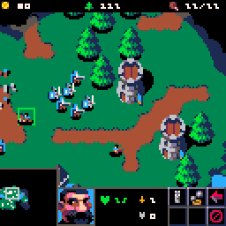
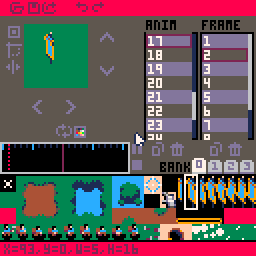
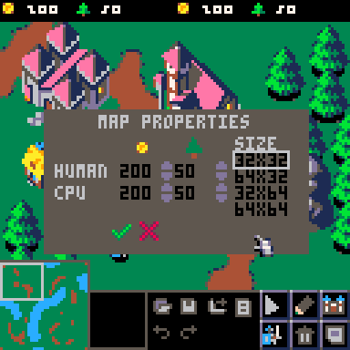
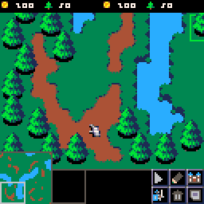

# Picocraft Tools

Two PICO-8 editors extracted and released from [Picocraft](https://www.lexaloffle.com/bbs/?pid=165229), a Warcraft III demake built in PICO-8. Originally developed for internal use, these tools are now open to the community for any PICO-8 project.

> Picocraft has been out in the wild for about a year. These tools are a way to celebrate that anniversary and give something back to the community.



---

## Tools

- **`anim_editor.p8`**  Sprite animation editor
- **`map_editor.p8`**  Tile map and level editor

Both tools share the same sprite bank convention and can be used independently or together.

---

## Requirements

- [PICO-8](https://www.lexaloffle.com/pico-8.php) version 0.2.4 or later
- Up to 4 sprite sheet cartridges (`pack1.p8` ... `pack4.p8`)

---

## Setup

Both editors load sprites from up to 4 external cartridges placed in the same folder.
Name them `pack1.p8`, `pack2.p8`, `pack3.p8`, `pack4.p8`.

Each file must be a standard PICO-8 cartridge whose `__gfx__` section contains your sprite sheet.
Missing files are handled gracefully, the corresponding bank will appear empty (black) and a message will be displayed.

```
your_project/
├── anim_editor.p8
├── map_editor.p8
├── pack1.p8   <- sprite sheet bank 0
├── pack2.p8   <- sprite sheet bank 1
├── pack3.p8   <- sprite sheet bank 2 (optional)
└── pack4.p8   <- sprite sheet bank 3 (optional)
```

---

## Working with Sprite Banks

### Editing sprites directly in PICO-8

The simplest workflow is to open each pack cartridge directly in PICO-8 and draw your sprites using the built-in sprite editor. Save the file and reload the tool, the banks are read fresh at startup.

```
1. Open pack1.p8 in PICO-8
2. Draw your sprites in the sprite editor
3. Save (Ctrl+S)
4. Launch anim_editor.p8 or map_editor.p8
```

### Importing from an external editor

If you prefer drawing in Aseprite or another pixel art tool, PICO-8 has a built-in import command. Export your sprite sheet as a PNG, then in the PICO-8 console:

```
load pack1.p8
import spritesheet.png
save
```

This replaces the `__gfx__` section of the cartridge with your image. The sprite sheet must be 128×128 pixels (the standard PICO-8 sprite sheet size) and use the PICO-8 16-color palette.

### Color conventions for Picocraft-style games

If you are building a game with player-colored units and buildings, Picocraft uses the following conventions:

**Buildings**  draw them using pink (color 14) as the player color. The game replaces pink with blue for player 1 and yellow for player 2 at runtime using palette swaps.

**Units**  draw them using blue (color 12). The game replaces blue with yellow for player 2 at runtime.

These conventions are not enforced by the editors  they are only relevant if your game uses the same palette swap approach as Picocraft.

---

## Animation Editor



A frame-by-frame sprite animation editor with real-time preview.

### Configuration

At the top of `anim_editor.p8`, three constants control the file names used by the editor:

```lua
cfg_anim_cart   = "picocraft.p8"       -- cartridge containing animation data
cfg_pack_prefix = "pack"               -- prefix for sprite bank files
```

Change these to match your project. For example:

```lua
cfg_anim_cart   = "my_game.p8"
cfg_pack_prefix = "sheet"  -- will look for sheet1.p8, sheet2.p8 ...
```

### Features

- Create and manage multiple named animations
- Add, copy and delete frames
- Per-frame controls: sprite selection, X/Y offset, horizontal flip, marker flag
- Adjustable playback speed (ticks per frame)
- Once / loop toggle per animation
- Transparent color picker per animation
- Real-time preview with play / pause / stop
- Timeline scrubber
- 4 sprite bank tabs
- Scrollable animation and frame lists
- Undo / redo (10 levels)
- Save / load / export

### Save format

Animations are saved as binary data inside `anim_editor.p8` at address `0x2000`. The format is compact and designed to be reloaded by the game at runtime. It is exported to `cfg_anim_cart` at `0x0800`, and can fill up to 10240 bytes in the picocraft context.

#### Binary layout

```
[nb_anims: 1 byte]
for each animation:
  once    1 byte  -- 1 = play once, 0 = loop
  transp  1 byte  -- transparent color index (bit position)
  sfrm    1 byte  -- frame index that triggers the sfx
  sfx     1 byte  -- sfx number to play on sfrm
  nbfrm   1 byte  -- number of frames
  for each frame:
    b     1 byte  -- sprite bank (0-3)
    x     1 byte  -- sprite x in sheet
    y     1 byte  -- sprite y in sheet
    w     1 byte  -- width in pixels
    h     1 byte  -- height in pixels
    ofx   1 byte  -- x draw offset
    ofy   1 byte  -- y draw offset
```

All values are stored as single bytes (0-255), offset by 127 (i.e. stored value = actual value + 127).

#### Loading animations at runtime

```lua
function read_byte()
 local val=@read_addr-roff
 read_addr+=1
 return val
end

function loadblk(keys)
 local blk={}
 for v in all(keys) do
  blk[v]=read_byte()
 end
 return blk
end

function loadanim()
 read_addr,roff=0x800,127
 anims={}
 for i=1,read_byte() do
  local newanim=loadblk(
   split"once,transp,sfrm,sfx,nbfrm")
  newanim.once=newanim.once==1
  newanim.transp=0x8000>>>newanim.transp
  add(anims,newanim)
  for j=1,newanim.nbfrm do
   add(newanim,
    loadblk(split"b,x,y,w,h,ofx,ofy"))
  end
 end
end
```

Call `loadanim()` once at startup after loading your sprite banks. Animations are stored in the global `anims` table, indexed from 1.

#### Drawing an animation

```lua
-- pos    : {x, y} world position
-- ianim  : animation index (1-based)
-- ti     : time index (frame counter)
-- flipx  : boolean, mirror horizontally
-- u      : unit/entity table (needs .w field for flip offset)
function draw_anim(pos,ianim,ti,flipx,u)
 local anim=anims[ianim]
 if (not anim) return
 pal()
 palt(anim.transp)
 local x,y=pos[1]-camx,pos[2]-camy
 local toff=anim.once
  and min(ti+1,anim.nbfrm)
  or ti%anim.nbfrm+1
 -- sfx trigger
 if anim.sfrm==toff and frm%3==0 then
  if x>0 and x<128 then sfx(anim.sfx) end
 end
 local s=anim[toff]
 local ofx=flipx
  and u.w-s.w-s.ofx or s.ofx
 vsspr(s.b,s.x,s.y,s.w,s.h,
  x+ofx,y+s.ofy,nil,nil,flipx)
end

-- draws a sprite from extended RAM banks
-- b: bank index (0-3), maps to 0x8000/0xa000/0xc000/0xe000
function vsspr(b,sx,sy,w,h,dx,dy,dw,dh,flipx)
 poke(0x5f54,b*32+128)
 sspr(sx,sy,w,h,dx,dy,
  dw or w,dh or h,flipx or false)
 poke(0x5f54,0)
end
```

`ti` is typically your entity's frame counter incremented each tick. Divide by your desired ticks-per-frame before passing to `draw_anim`. The `sfrm`/`sfx` fields allow each animation to trigger a sound effect on a specific frame.

---

## Map Editor



A tile map editor with support for terrain painting, object placement, unit placement and level export.

### Features

- Terrain painting with 3 terrain types (grass / dirt / water)
- Auto-tiling tile transitions are computed automatically
- Object / building placement with per-player color coding
- Unit placement with per-player color coding
- Select and drag elements to reposition them
- Delete tool
- 4 levels (maps) selectable in the file menu
- Minimap with click-to-navigate
- Camera scroll (arrow keys or screen edges)
- Undo (10 levels) for terrain, element placement, movement and deletion
- Save / load per level
- Export to game cartridge

### Map sizes

The editor supports 4 fixed map sizes:

| Size | Tiles | Pixels |
|---|---|---|
| 32×32 | 1024 tiles | 256×256 |
| 32×64 | 2048 tiles | 256×512 |
| 64×32 | 2048 tiles | 512×256 |
| 64×64 | 4096 tiles | 512×512 |

Map size is configured per level in the map properties panel (file menu -> map props).

### Element limit

Objects and units per level are serialized into a 768-byte block. The editor displays a warning when this limit is approached. If you exceed it, saving will be blocked and an error message will be shown.

### Terrain types

| Value | Type |
|---|---|
| 0 | Grass |
| 1 | Dirt |
| 2 | Water |

Transitions between terrain types are handled automatically by the auto-tiling system.



### Configuration

At the top of `map_editor.p8`, three constants control the file names used by the editor:

```lua
cfg_anim_cart   = "picocraft.p8"       -- cartridge containing animation data
cfg_export_cart = "start_picocraft.p8" -- cartridge to export levels into
cfg_pack_prefix = "pack"               -- prefix for sprite bank files
```

Change these to match your project. For example:

```lua
cfg_anim_cart   = "my_game.p8"
cfg_export_cart = "my_game_start.p8"
cfg_pack_prefix = "sheet"  -- will look for sheet1.p8, sheet2.p8 ...
```

### Save format

Each level is saved into its corresponding `packN.p8` file:

| Data | Address | Size |
|---|---|---|
| Tilemap | `0x2000` | `0x1000` (4096 bytes) |
| Objects, units, metadata | `0x3200` | 768 bytes |

### Export format

The export function compiles all 4 maps into the game cartridges:

**In `cfg_export_cart`** (`start_picocraft.p8` by default):
- Number of maps -> `0x1000` (1 byte)
- Map length headers -> `0xd01`..`0xd08` (2 bytes per map)
- Compressed map data -> from `0xd09` onward, all 4 maps concatenated

**In `cfg_anim_cart`** (`picocraft.p8` by default):
- Elements for map N (objects, units) -> `0x1d00 + N*768` (768 bytes each, N=1..4)

---

## About Picocraft

Picocraft is a Warcraft III demake for PICO-8, featuring:

- RTS gameplay loop: resource gathering, building, unit production
- Two factions with upgrades
- AI opponents with multiple strategies
- Fog of war and line of sight
- 4 hand-crafted maps
- Pathfinding, combat, and more, all within PICO-8's constraints

These tools were built to create picocraft's animations and maps, and are now released as standalone utilities for the broader PICO-8 community.

👉 [Play Picocraft on Lexaloffle BBS](https://www.lexaloffle.com/bbs/?pid=165229)

---

## Credits

- Code: [@yourykiki](https://x.com/yourykiki)
- Art: [@brullov_art](https://x.com/brullov_art)

---

## License

This project is licensed under [Creative Commons Attribution-NonCommercial-ShareAlike 4.0 International](https://creativecommons.org/licenses/by-nc-sa/4.0/).

**You are free to:**
- Share and redistribute the tools
- Adapt and build upon them for your own projects

**Under the following terms:**
- **BY** — Credit the original authors
- **NC** — No commercial use
- **SA** — Derivatives must use the same license

Code © @yourykiki — Art © @brullov_art

